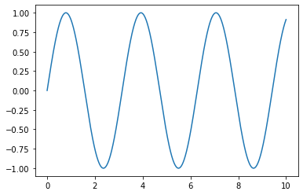

# How to think in JAX

JAX provides a simple and powerful API for writing accelerated numerical code,
but working effectively in JAX sometimes requires extra consideration.
This document is meant to help build a ground-up understanding of how JAX operates,
so that you can use it more effectively.

## JAX vs. NumPy

**Key Concepts:**

- JAX provides a NumPy-inspired interface for convenience.
- Through duck-typing, JAX arrays can often be used as drop-in replacements of NumPy arrays.
- Unlike NumPy arrays, JAX arrays are always immutable.

NumPy provides a well-known, powerful API for working with numerical data.
For convenience, JAX includes the `jax.numpy` module, which closely mirrors the
NumPy API and provides easy entry into JAX. Here are some operations you might do in `numpy`:


```python
import matplotlib.pyplot as plt
```


```python
import numpy as np
x = np.linspace(0, 10, 1000)
y = 2 * np.sin(x) * np.cos(x)
plt.plot(x, y)
```


    [<matplotlib.lines.Line2D at 0x7f0a427ea7b8>]


    

    


And here is the equivalent with `jax.numpy`:


```python
plt.close()
```


```python
import jax.numpy as jnp
x = jnp.linspace(0, 10, 1000)
y = 2 * jnp.sin(x) * jnp.cos(x)
plt.plot(x, y)
```


    [<matplotlib.lines.Line2D at 0x7f0a0a5927f0>]


    

    


The code blocks are identical aside from replacing `np` with `jnp`, and the results are the same.
As we can see, JAX arrays can often be used directly in place of NumPy arrays for things like plotting.

The arrays themselves are implemented as different Python types:


```python
type(np.arange(10))
```


    numpy.ndarray


```python
type(jnp.arange(10))
```


    jax.interpreters.xla._DeviceArray


Python's [duck-typing](https://en.wikipedia.org/wiki/Duck_typing>) allows JAX arrays and NumPy arrays
to be used interchangeably in many places.

However, there is one important difference between JAX and NumPy arrays: JAX arrays are immutable,
meaning that once created their contents cannot be changed.

Here is an example of mutating an array in Numpy:


```python
x = np.arange(10) # NumPy: mutable arrays
```


```python
x[0] = 10
```


```python
x
```


    array([10,  1,  2,  3,  4,  5,  6,  7,  8,  9])


The equivalent in JAX results in an error, as JAX arrays are immutable:


```python
x = jnp.arange(10) # JAX: immutable arrays
```


```python
x[0] = 10
```


    ---------------------------------------------------------------------------

    TypeError                                 Traceback (most recent call last)

    <ipython-input-11-d8268ef9d1f3> in <module>()
    ----> 1 x[0] = 10
    

    /usr/local/lib/python3.6/dist-packages/jax/_src/numpy/lax_numpy.py in _unimplemented_setitem(self, i, x)
       4968          "immutable; perhaps you want jax.ops.index_update or "
       4969          "jax.ops.index_add instead?")
    -> 4970   raise TypeError(msg.format(type(self)))
       4971 
       4972 def _operator_round(number, ndigits=None):


    TypeError: '<class 'jax.interpreters.xla._DeviceArray'>' object does not support item assignment. JAX arrays are immutable; perhaps you want jax.ops.index_update or jax.ops.index_add instead?


For updating individual elements, JAX provides an
[indexed update syntax](https://jax.readthedocs.io/en/latest/jax.ops.html#syntactic-sugar-for-indexed-update-operators)
that returns an updated copy:


```python
x.at[0].set(10)
```


    DeviceArray([10,  1,  2,  3,  4,  5,  6,  7,  8,  9], dtype=int32)


## NumPy, lax & XLA: JAX's layers of API

**Key Concepts:**

- `jax.numpy` is a high-level wrapper that provides a familiar interface.
- `jax.lax` is a lower-level API that is stricter and often more powerful.
- All JAX operations are implemented in terms of operations in
  [XLA](www.tensorflow.org/xla/)  – the Accelerated Linear Algebra compiler.

If you look at the source of `jax.numpy`, you'll see that all the operations are eventually
expressed in terms of functions defined in `jax.lax`.
You can think of `jax.lax` as a stricter, but often more powerful, API for working with
multi-dimensional arrays.

For example, `jax.numpy` will implicitly promote arguments to allow operations
between mixed data types:


```python
import jax.numpy as jnp
```


```python
jnp.add(1, 1.0) # jax.numpy API implicitly promotes mixed types.
```


    DeviceArray(2., dtype=float32)


and `jax.lax` will not:


```python
from jax import lax
```


```python
lax.add(1, 1.0) # jax.lax API requires explicit type promotion.
```


    ---------------------------------------------------------------------------

    TypeError                                 Traceback (most recent call last)

    <ipython-input-16-760093372035> in <module>()
    ----> 1 lax.add(1, 1.0) # jax.lax API requires explicit type promotion.
    

    /usr/local/lib/python3.6/dist-packages/jax/_src/lax/lax.py in add(x, y)
        343 def add(x: Array, y: Array) -> Array:
        344   r"""Elementwise addition: :math:`x + y`."""
    --> 345   return add_p.bind(x, y)
        346 
        347 def sub(x: Array, y: Array) -> Array:


    /usr/local/lib/python3.6/dist-packages/jax/core.py in bind(self, *args, **params)
        269     top_trace = find_top_trace(args)
        270     tracers = map(top_trace.full_raise, args)
    --> 271     out = top_trace.process_primitive(self, tracers, params)
        272     return map(full_lower, out) if self.multiple_results else full_lower(out)
        273 


    /usr/local/lib/python3.6/dist-packages/jax/core.py in process_primitive(self, primitive, tracers, params)
        593 
        594   def process_primitive(self, primitive, tracers, params):
    --> 595     return primitive.impl(*tracers, **params)
        596 
        597   def process_call(self, primitive, f, tracers, params):


    /usr/local/lib/python3.6/dist-packages/jax/interpreters/xla.py in apply_primitive(prim, *args, **params)
        233 def apply_primitive(prim, *args, **params):
        234   """Impl rule that compiles and runs a single primitive 'prim' using XLA."""
    --> 235   compiled_fun = xla_primitive_callable(prim, *unsafe_map(arg_spec, args), **params)
        236   return compiled_fun(*args)
        237 


    /usr/local/lib/python3.6/dist-packages/jax/interpreters/xla.py in xla_primitive_callable(prim, *arg_specs, **params)
        258     return _xla_callable(lu.wrap_init(prim_fun), device, None, "prim", donated_invars,
        259                          *arg_specs)
    --> 260   aval_out = prim.abstract_eval(*avals, **params)
        261   if not prim.multiple_results:
        262     handle_result = aval_to_result_handler(device, aval_out)


    /usr/local/lib/python3.6/dist-packages/jax/_src/lax/lax.py in standard_abstract_eval(prim, shape_rule, dtype_rule, *args, **kwargs)
       2009     out_avals = safe_map(ConcreteArray, out_vals)
       2010   elif least_specialized is ShapedArray:
    -> 2011     shapes, dtypes = shape_rule(*args, **kwargs), dtype_rule(*args, **kwargs)
       2012     if not prim.multiple_results:
       2013       shapes, dtypes = [shapes], [dtypes]


    /usr/local/lib/python3.6/dist-packages/jax/_src/lax/lax.py in naryop_dtype_rule(result_dtype, accepted_dtypes, name, *avals, **kwargs)
       2069         typenames = ', '.join(t.__name__ for t in types)
       2070         raise TypeError(msg.format(name, typename, i, i, typenames))
    -> 2071   _check_same_dtypes(name, False, *aval_dtypes)
       2072   return result_dtype(*avals)
       2073 


    /usr/local/lib/python3.6/dist-packages/jax/_src/lax/lax.py in _check_same_dtypes(name, ignore_fp_precision, *ttypes)
       6030     else:
       6031       msg = "{} requires arguments to have the same dtypes, got {}."
    -> 6032     raise TypeError(msg.format(name, ", ".join(map(str, types))))
       6033 
       6034 


    TypeError: add requires arguments to have the same dtypes, got int32, float32.


If using `jax.lax` directly, you'll have to do type promotion explicitly in such cases:


```python
from jax import lax
```


```python
lax.add(jnp.float32(1), 1.0)
```


    DeviceArray(2., dtype=float32)


Along with this strictness, `jax.lax` also provides efficient APIs for some more
general operations than are supported by NumPy.

For example, consider a 1D convolution, which can be expressed in NumPy this way:


```python
x = jnp.array([1, 2, 1])
```


```python
y = jnp.ones(10)
```


```python
jnp.convolve(x, y)
```


    DeviceArray([1., 3., 4., 4., 4., 4., 4., 4., 4., 4., 3., 1.], dtype=float32)


Under the hood, this NumPy operation is translated to a much more general convolution implemented by
`jax.lax.conv_general_dilated`:


```python
result = lax.conv_general_dilated(
    x.reshape(1, 1, 3).astype(float), #note: explicit promotion
    y.reshape(1, 1, 10),
    window_strides=(1,),
    padding=[(len(y) - 1, len(y) - 1)]) # equivalent of padding='full' in NumPy
```


```python
result[0, 0]
```


    DeviceArray([1., 3., 4., 4., 4., 4., 4., 4., 4., 4., 3., 1.], dtype=float32)


This is a batched convolution operation designed to be efficient for the types of convolutions often
used in deep neural nets. It requires much more boilerplate, but is far more flexible and scalable
than the convolution provided by NumPy (See
[JAX Sharp Bits: Convolutions](https://jax.readthedocs.io/en/latest/notebooks/Common_Gotchas_in_JAX.html#%F0%9F%94%AA-Convolutions)
for more detail on JAX convolutions).


## To JIT or not to JIT

**Key Concepts:**

- By default JAX executes operations one at a time, in sequence.
- Using a just-in-time (JIT) compilation decorator, sequences of operations can be optimized
  together and run at once.
- Not all JAX code can be JIT compiled, as it requires array shapes to be static and known at
  compile time.

The fact that all JAX operations are expressed in terms of XLA allows JAX to use the XLA
compiler to execute blocks of code very efficiently.

For example, consider this function that normalizes the rows of a 2D matrix,
expressed in terms of `jax.numpy` operations:


```python
def norm(X):
  X = X - X.mean(0)
  return X / X.std(0)
```

A just-in-time compiled version of the function can be created using the `jax.jit` transform:


```python
from jax import jit
```


```python
norm_compiled = jit(norm)
```

This function returns the same results as the original, up to standard floating-point accuracy:


```python
np.random.seed(1701)
```


```python
X = jnp.array(np.random.rand(10000, 10))
```


```python
np.allclose(norm(X), norm_compiled(X), atol=1E-6)
```


    True


But due to the compilation (which includes fusing of operations, avoidance of allocating temporary
arrays, and a host of other tricks), execution times can be orders of magnitude faster in the 
JIT-compiled case (note the use of `~jax.xla.DeviceArray.block_until_ready`
to account for JAX's `async-dispatch`):


```python
%timeit norm(X).block_until_ready()
```

    100 loops, best of 3: 4.39 ms per loop


```python
%timeit norm_compiled(X).block_until_ready()
```

    1000 loops, best of 3: 382 µs per loop


That said, `jax.jit` does have limitations: in particular, it requires all arrays to have
static shapes. That means that some JAX operations are incompatible with JIT compilation.

For example, this operation can be executed in op-by-op mode:


```python
def get_negatives(x):
  return x[x < 0]
```


```python
x = jnp.array(np.random.randn(10))
```


```python
get_negatives(x)
```


    DeviceArray([-0.10570311, -0.59403396, -0.8680282 , -0.23489487], dtype=float32)


But it returns an error if you attempt to execute it in JIT mode:


```python
jit(get_negatives)(x)
```


    ---------------------------------------------------------------------------

    IndexError                                Traceback (most recent call last)

    <ipython-input-35-ec8799cf80d7> in <module>()
    ----> 1 jit(get_negatives)(x)
    

    /usr/local/lib/python3.6/dist-packages/jax/api.py in f_jitted(*args, **kwargs)
        369         return cache_miss(*args, **kwargs)[0]  # probably won't return
        370     else:
    --> 371       return cpp_jitted_f(*args, **kwargs)
        372   f_jitted._cpp_jitted_f = cpp_jitted_f
        373 


    /usr/local/lib/python3.6/dist-packages/jax/api.py in cache_miss(*args, **kwargs)
        282         backend=backend,
        283         name=flat_fun.__name__,
    --> 284         donated_invars=donated_invars)
        285     out_pytree_def = out_tree()
        286     out = tree_unflatten(out_pytree_def, out_flat)


    /usr/local/lib/python3.6/dist-packages/jax/core.py in bind(self, fun, *args, **params)
       1227 
       1228   def bind(self, fun, *args, **params):
    -> 1229     return call_bind(self, fun, *args, **params)
       1230 
       1231   def process(self, trace, fun, tracers, params):


    /usr/local/lib/python3.6/dist-packages/jax/core.py in call_bind(primitive, fun, *args, **params)
       1218   tracers = map(top_trace.full_raise, args)
       1219   with maybe_new_sublevel(top_trace):
    -> 1220     outs = primitive.process(top_trace, fun, tracers, params)
       1221   return map(full_lower, apply_todos(env_trace_todo(), outs))
       1222 


    /usr/local/lib/python3.6/dist-packages/jax/core.py in process(self, trace, fun, tracers, params)
       1230 
       1231   def process(self, trace, fun, tracers, params):
    -> 1232     return trace.process_call(self, fun, tracers, params)
       1233 
       1234   def post_process(self, trace, out_tracers, params):


    /usr/local/lib/python3.6/dist-packages/jax/core.py in process_call(self, primitive, f, tracers, params)
        596 
        597   def process_call(self, primitive, f, tracers, params):
    --> 598     return primitive.impl(f, *tracers, **params)
        599   process_map = process_call
        600 


    /usr/local/lib/python3.6/dist-packages/jax/interpreters/xla.py in _xla_call_impl(fun, device, backend, name, donated_invars, *args)
        568 def _xla_call_impl(fun: lu.WrappedFun, *args, device, backend, name, donated_invars):
        569   compiled_fun = _xla_callable(fun, device, backend, name, donated_invars,
    --> 570                                *unsafe_map(arg_spec, args))
        571   try:
        572     return compiled_fun(*args)


    /usr/local/lib/python3.6/dist-packages/jax/linear_util.py in memoized_fun(fun, *args)
        249       fun.populate_stores(stores)
        250     else:
    --> 251       ans = call(fun, *args)
        252       cache[key] = (ans, fun.stores)
        253 


    /usr/local/lib/python3.6/dist-packages/jax/interpreters/xla.py in _xla_callable(fun, device, backend, name, donated_invars, *arg_specs)
        643   abstract_args, arg_devices = unzip2(arg_specs)
        644   if config.omnistaging_enabled:
    --> 645     jaxpr, out_avals, consts = pe.trace_to_jaxpr_final(fun, abstract_args)
        646     if any(isinstance(c, core.Tracer) for c in consts):
        647       raise core.UnexpectedTracerError("Encountered an unexpected tracer.")


    /usr/local/lib/python3.6/dist-packages/jax/interpreters/partial_eval.py in trace_to_jaxpr_final(fun, in_avals)
       1228     main.source_info = fun_sourceinfo(fun.f)  # type: ignore
       1229     main.jaxpr_stack = ()  # type: ignore
    -> 1230     jaxpr, out_avals, consts = trace_to_subjaxpr_dynamic(fun, main, in_avals)
       1231     del main
       1232   return jaxpr, out_avals, consts


    /usr/local/lib/python3.6/dist-packages/jax/interpreters/partial_eval.py in trace_to_subjaxpr_dynamic(fun, main, in_avals)
       1209     trace = DynamicJaxprTrace(main, core.cur_sublevel())
       1210     in_tracers = map(trace.new_arg, in_avals)
    -> 1211     ans = fun.call_wrapped(*in_tracers)
       1212     out_tracers = map(trace.full_raise, ans)
       1213   jaxpr, out_avals, consts = frame.to_jaxpr(in_tracers, out_tracers)


    /usr/local/lib/python3.6/dist-packages/jax/linear_util.py in call_wrapped(self, *args, **kwargs)
        158 
        159     try:
    --> 160       ans = self.f(*args, **dict(self.params, **kwargs))
        161     except:
        162       # Some transformations yield from inside context managers, so we have to


    <ipython-input-32-67da1a818890> in get_negatives(x)
          1 def get_negatives(x):
    ----> 2   return x[x < 0]
    

    /usr/local/lib/python3.6/dist-packages/jax/core.py in __getitem__(self, idx)
        523   def __rshift__(self, other): return self.aval._rshift(self, other)
        524   def __rrshift__(self, other): return self.aval._rrshift(self, other)
    --> 525   def __getitem__(self, idx): return self.aval._getitem(self, idx)
        526   def __nonzero__(self): return self.aval._nonzero(self)
        527   def __bool__(self): return self.aval._bool(self)


    /usr/local/lib/python3.6/dist-packages/jax/_src/numpy/lax_numpy.py in _rewriting_take(arr, idx)
       4102   # followed by an optional reverse and broadcast_in_dim.
       4103   arr = asarray(arr)
    -> 4104   treedef, static_idx, dynamic_idx = _split_index_for_jit(idx)
       4105   return _gather(arr, treedef, static_idx, dynamic_idx)
       4106 


    /usr/local/lib/python3.6/dist-packages/jax/_src/numpy/lax_numpy.py in _split_index_for_jit(idx)
       4162   # Expand any (concrete) boolean indices. We can then use advanced integer
       4163   # indexing logic to handle them.
    -> 4164   idx = _expand_bool_indices(idx)
       4165 
       4166   leaves, treedef = tree_flatten(idx)


    /usr/local/lib/python3.6/dist-packages/jax/_src/numpy/lax_numpy.py in _expand_bool_indices(idx)
       4429         # TODO(mattjj): improve this error by tracking _why_ the indices are not
       4430         # concrete
    -> 4431         raise IndexError("Array boolean indices must be concrete.")
       4432       else:
       4433         out.extend(np.where(i))


    IndexError: Array boolean indices must be concrete.


This is because the function generates an array whose shape is not known at compile time:
the size of the output depends on the values of the input array, and so it is not compatible with JIT.

## JIT mechanics: tracing and static variables

**Key Concepts:**

- JIT and other JAX transforms work by *tracing* a function to determine its effect on inputs
  of a specific shape and type.
- Variables that you don't want to be traced can be marked as *static*

To use `jax.jit` effectively, it is useful to understand how it works.
Let's put a few `print()` statements within a JIT-compiled function and see what we find:


```python
@jit
def f(x, y):
  print("Running f():")
  print(f"  x = {x}")
  print(f"  y = {y}")
  result = jnp.dot(x + 1, y + 1)
  print(f"  result = {result}")
  return result
```

The first time this function is run, what is printed is not the data we passed to the function,
but rather *tracer* objects that stand-in for them:


```python
x = np.random.randn(3, 4)
```


```python
y = np.random.randn(4)
```


```python
f(x, y)
```

    Running f():
      x = Traced<ShapedArray(float32[3,4])>with<DynamicJaxprTrace(level=0/1)>
      y = Traced<ShapedArray(float32[4])>with<DynamicJaxprTrace(level=0/1)>
      result = Traced<ShapedArray(float32[3])>with<DynamicJaxprTrace(level=0/1)>


    DeviceArray([0.25773212, 5.3623195 , 5.4032435 ], dtype=float32)


These tracer objects are what `jax.jit` uses to extract the sequence of operations specified
by the function. Basic tracers are stand-ins that encode the **shape** and **dtype** of the arrays,
but are agnostic to the values. This recorded sequence of computations can then be efficiently
applied within XLA to new inputs with the same shape and dtype, without having to re-execute the
Python code.

When we call the compiled fuction again on matching inputs, no re-compilation is required:


```python
x2 = np.random.randn(3, 4)
```


```python
y2 = np.random.randn(4)
```


```python
f(x2, y2)
```


    DeviceArray([1.4344587, 4.3004417, 7.989701 ], dtype=float32)


The extracted sequence of operations is encoded in a JAX expression, or *jaxpr* for short.
You can view the jaxpr using the `jax.make_jaxpr` transformation:


```python
from jax import make_jaxpr
```


```python
def f(x, y):
  return jnp.dot(x + 1, y + 1)
```


```python
make_jaxpr(f)(x, y)
```


    { lambda  ; a b.
      let c = add a 1.0
          d = add b 1.0
          e = dot_general[ dimension_numbers=(((1,), (0,)), ((), ()))
                           precision=None ] c d
      in (e,) }


Note one consequence of this: because JIT compilation is done *without* information on the content
of the array, control flow statements in the function cannot depend on traced values.
For example, this fails:


```python
@jit
def f(x, neg):
  return -x if neg else x
```


```python
f(1, True)
```


    ---------------------------------------------------------------------------

    ConcretizationTypeError                   Traceback (most recent call last)

    <ipython-input-47-548d405aa930> in <module>()
    ----> 1 f(1, True)
    

    /usr/local/lib/python3.6/dist-packages/jax/api.py in f_jitted(*args, **kwargs)
        369         return cache_miss(*args, **kwargs)[0]  # probably won't return
        370     else:
    --> 371       return cpp_jitted_f(*args, **kwargs)
        372   f_jitted._cpp_jitted_f = cpp_jitted_f
        373 


    /usr/local/lib/python3.6/dist-packages/jax/api.py in cache_miss(*args, **kwargs)
        282         backend=backend,
        283         name=flat_fun.__name__,
    --> 284         donated_invars=donated_invars)
        285     out_pytree_def = out_tree()
        286     out = tree_unflatten(out_pytree_def, out_flat)


    /usr/local/lib/python3.6/dist-packages/jax/core.py in bind(self, fun, *args, **params)
       1227 
       1228   def bind(self, fun, *args, **params):
    -> 1229     return call_bind(self, fun, *args, **params)
       1230 
       1231   def process(self, trace, fun, tracers, params):


    /usr/local/lib/python3.6/dist-packages/jax/core.py in call_bind(primitive, fun, *args, **params)
       1218   tracers = map(top_trace.full_raise, args)
       1219   with maybe_new_sublevel(top_trace):
    -> 1220     outs = primitive.process(top_trace, fun, tracers, params)
       1221   return map(full_lower, apply_todos(env_trace_todo(), outs))
       1222 


    /usr/local/lib/python3.6/dist-packages/jax/core.py in process(self, trace, fun, tracers, params)
       1230 
       1231   def process(self, trace, fun, tracers, params):
    -> 1232     return trace.process_call(self, fun, tracers, params)
       1233 
       1234   def post_process(self, trace, out_tracers, params):


    /usr/local/lib/python3.6/dist-packages/jax/core.py in process_call(self, primitive, f, tracers, params)
        596 
        597   def process_call(self, primitive, f, tracers, params):
    --> 598     return primitive.impl(f, *tracers, **params)
        599   process_map = process_call
        600 


    /usr/local/lib/python3.6/dist-packages/jax/interpreters/xla.py in _xla_call_impl(fun, device, backend, name, donated_invars, *args)
        568 def _xla_call_impl(fun: lu.WrappedFun, *args, device, backend, name, donated_invars):
        569   compiled_fun = _xla_callable(fun, device, backend, name, donated_invars,
    --> 570                                *unsafe_map(arg_spec, args))
        571   try:
        572     return compiled_fun(*args)


    /usr/local/lib/python3.6/dist-packages/jax/linear_util.py in memoized_fun(fun, *args)
        249       fun.populate_stores(stores)
        250     else:
    --> 251       ans = call(fun, *args)
        252       cache[key] = (ans, fun.stores)
        253 


    /usr/local/lib/python3.6/dist-packages/jax/interpreters/xla.py in _xla_callable(fun, device, backend, name, donated_invars, *arg_specs)
        643   abstract_args, arg_devices = unzip2(arg_specs)
        644   if config.omnistaging_enabled:
    --> 645     jaxpr, out_avals, consts = pe.trace_to_jaxpr_final(fun, abstract_args)
        646     if any(isinstance(c, core.Tracer) for c in consts):
        647       raise core.UnexpectedTracerError("Encountered an unexpected tracer.")


    /usr/local/lib/python3.6/dist-packages/jax/interpreters/partial_eval.py in trace_to_jaxpr_final(fun, in_avals)
       1228     main.source_info = fun_sourceinfo(fun.f)  # type: ignore
       1229     main.jaxpr_stack = ()  # type: ignore
    -> 1230     jaxpr, out_avals, consts = trace_to_subjaxpr_dynamic(fun, main, in_avals)
       1231     del main
       1232   return jaxpr, out_avals, consts


    /usr/local/lib/python3.6/dist-packages/jax/interpreters/partial_eval.py in trace_to_subjaxpr_dynamic(fun, main, in_avals)
       1209     trace = DynamicJaxprTrace(main, core.cur_sublevel())
       1210     in_tracers = map(trace.new_arg, in_avals)
    -> 1211     ans = fun.call_wrapped(*in_tracers)
       1212     out_tracers = map(trace.full_raise, ans)
       1213   jaxpr, out_avals, consts = frame.to_jaxpr(in_tracers, out_tracers)


    /usr/local/lib/python3.6/dist-packages/jax/linear_util.py in call_wrapped(self, *args, **kwargs)
        158 
        159     try:
    --> 160       ans = self.f(*args, **dict(self.params, **kwargs))
        161     except:
        162       # Some transformations yield from inside context managers, so we have to


    <ipython-input-46-849cf36534c5> in f(x, neg)
          1 @jit
          2 def f(x, neg):
    ----> 3   return -x if neg else x
    

    /usr/local/lib/python3.6/dist-packages/jax/core.py in __bool__(self)
        525   def __getitem__(self, idx): return self.aval._getitem(self, idx)
        526   def __nonzero__(self): return self.aval._nonzero(self)
    --> 527   def __bool__(self): return self.aval._bool(self)
        528   def __int__(self): return self.aval._int(self)
        529   def __long__(self): return self.aval._long(self)


    /usr/local/lib/python3.6/dist-packages/jax/core.py in error(self, arg)
        908                       f"or `jnp.array(x, {fun.__name__})` instead.")
        909   def error(self, arg):
    --> 910     raise_concretization_error(arg, fname_context)
        911   return error
        912 


    /usr/local/lib/python3.6/dist-packages/jax/core.py in raise_concretization_error(val, context)
        897          "See https://jax.readthedocs.io/en/latest/faq.html#abstract-tracer-value-encountered-where-concrete-value-is-expected-error for more information.\n\n"
        898           f"Encountered tracer value: {val}")
    --> 899   raise ConcretizationTypeError(msg)
        900 
        901 


    ConcretizationTypeError: Abstract tracer value encountered where concrete value is expected.
    
    The problem arose with the `bool` function. 
    
    While tracing the function f at <ipython-input-46-849cf36534c5>:1, this concrete value was not available in Python because it depends on the value of the arguments to f at <ipython-input-46-849cf36534c5>:1 at flattened positions [1], and the computation of these values is being staged out (that is, delayed rather than executed eagerly).
    
    You can use transformation parameters such as `static_argnums` for `jit` to avoid tracing particular arguments of transformed functions, though at the cost of more recompiles.
    
    See https://jax.readthedocs.io/en/latest/faq.html#abstract-tracer-value-encountered-where-concrete-value-is-expected-error for more information.
    
    Encountered tracer value: Traced<ShapedArray(bool[], weak_type=True)>with<DynamicJaxprTrace(level=0/1)>


If there are variables that you would not like to be traced,
they can be marked as static for the purposes of JIT compilation:


```python
from functools import partial
```


```python
@partial(jit, static_argnums=(1,))
def f(x, neg):
  return -x if neg else x
```


```python
f(1, True)
```


    DeviceArray(-1, dtype=int32)


Note that calling a JIT-compiled function with a different static argument results in re-compilation,
so the function still works as expected:


```python
f(1, False)
```


    DeviceArray(1, dtype=int32)


Understanding which values and operations will be static and which will be traced
is a key part of using `jax.jit` effectively.

## Static vs Traced Operations

**Key Concepts:**

- Just as values can be either static or traced, operations can be static or traced.

- Static operations are evaluated at compile-time in Python; traced operations are compiled
  and evaluated at run-time in XLA.

- Use `numpy` for operations that you want to be static; use `jax.numpy` for operations
  that you want to be traced.

This distinction between static and traced values makes it important to think about how to keep
a static value static. Consider this function:


```python
@jit
def f(x):
  return x.reshape(jnp.array(x.shape).prod())
```


```python
x = jnp.ones((2, 3))
```


```python
f(x)
```


    ---------------------------------------------------------------------------

    ConcretizationTypeError                   Traceback (most recent call last)

    <ipython-input-54-f2d123ee1505> in <module>()
    ----> 1 f(x)
    

    /usr/local/lib/python3.6/dist-packages/jax/api.py in f_jitted(*args, **kwargs)
        369         return cache_miss(*args, **kwargs)[0]  # probably won't return
        370     else:
    --> 371       return cpp_jitted_f(*args, **kwargs)
        372   f_jitted._cpp_jitted_f = cpp_jitted_f
        373 


    /usr/local/lib/python3.6/dist-packages/jax/api.py in cache_miss(*args, **kwargs)
        282         backend=backend,
        283         name=flat_fun.__name__,
    --> 284         donated_invars=donated_invars)
        285     out_pytree_def = out_tree()
        286     out = tree_unflatten(out_pytree_def, out_flat)


    /usr/local/lib/python3.6/dist-packages/jax/core.py in bind(self, fun, *args, **params)
       1227 
       1228   def bind(self, fun, *args, **params):
    -> 1229     return call_bind(self, fun, *args, **params)
       1230 
       1231   def process(self, trace, fun, tracers, params):


    /usr/local/lib/python3.6/dist-packages/jax/core.py in call_bind(primitive, fun, *args, **params)
       1218   tracers = map(top_trace.full_raise, args)
       1219   with maybe_new_sublevel(top_trace):
    -> 1220     outs = primitive.process(top_trace, fun, tracers, params)
       1221   return map(full_lower, apply_todos(env_trace_todo(), outs))
       1222 


    /usr/local/lib/python3.6/dist-packages/jax/core.py in process(self, trace, fun, tracers, params)
       1230 
       1231   def process(self, trace, fun, tracers, params):
    -> 1232     return trace.process_call(self, fun, tracers, params)
       1233 
       1234   def post_process(self, trace, out_tracers, params):


    /usr/local/lib/python3.6/dist-packages/jax/core.py in process_call(self, primitive, f, tracers, params)
        596 
        597   def process_call(self, primitive, f, tracers, params):
    --> 598     return primitive.impl(f, *tracers, **params)
        599   process_map = process_call
        600 


    /usr/local/lib/python3.6/dist-packages/jax/interpreters/xla.py in _xla_call_impl(fun, device, backend, name, donated_invars, *args)
        568 def _xla_call_impl(fun: lu.WrappedFun, *args, device, backend, name, donated_invars):
        569   compiled_fun = _xla_callable(fun, device, backend, name, donated_invars,
    --> 570                                *unsafe_map(arg_spec, args))
        571   try:
        572     return compiled_fun(*args)


    /usr/local/lib/python3.6/dist-packages/jax/linear_util.py in memoized_fun(fun, *args)
        249       fun.populate_stores(stores)
        250     else:
    --> 251       ans = call(fun, *args)
        252       cache[key] = (ans, fun.stores)
        253 


    /usr/local/lib/python3.6/dist-packages/jax/interpreters/xla.py in _xla_callable(fun, device, backend, name, donated_invars, *arg_specs)
        643   abstract_args, arg_devices = unzip2(arg_specs)
        644   if config.omnistaging_enabled:
    --> 645     jaxpr, out_avals, consts = pe.trace_to_jaxpr_final(fun, abstract_args)
        646     if any(isinstance(c, core.Tracer) for c in consts):
        647       raise core.UnexpectedTracerError("Encountered an unexpected tracer.")


    /usr/local/lib/python3.6/dist-packages/jax/interpreters/partial_eval.py in trace_to_jaxpr_final(fun, in_avals)
       1228     main.source_info = fun_sourceinfo(fun.f)  # type: ignore
       1229     main.jaxpr_stack = ()  # type: ignore
    -> 1230     jaxpr, out_avals, consts = trace_to_subjaxpr_dynamic(fun, main, in_avals)
       1231     del main
       1232   return jaxpr, out_avals, consts


    /usr/local/lib/python3.6/dist-packages/jax/interpreters/partial_eval.py in trace_to_subjaxpr_dynamic(fun, main, in_avals)
       1209     trace = DynamicJaxprTrace(main, core.cur_sublevel())
       1210     in_tracers = map(trace.new_arg, in_avals)
    -> 1211     ans = fun.call_wrapped(*in_tracers)
       1212     out_tracers = map(trace.full_raise, ans)
       1213   jaxpr, out_avals, consts = frame.to_jaxpr(in_tracers, out_tracers)


    /usr/local/lib/python3.6/dist-packages/jax/linear_util.py in call_wrapped(self, *args, **kwargs)
        158 
        159     try:
    --> 160       ans = self.f(*args, **dict(self.params, **kwargs))
        161     except:
        162       # Some transformations yield from inside context managers, so we have to


    <ipython-input-52-e448ab8dce9a> in f(x)
          1 @jit
          2 def f(x):
    ----> 3   return x.reshape(jnp.array(x.shape).prod())
    

    /usr/local/lib/python3.6/dist-packages/jax/_src/numpy/lax_numpy.py in _reshape_method(a, *newshape, **kwargs)
       1290           type(newshape[0]) is not Poly):
       1291     newshape = newshape[0]
    -> 1292   return _reshape(a, newshape, order=order)
       1293 
       1294 


    /usr/local/lib/python3.6/dist-packages/jax/_src/numpy/lax_numpy.py in _reshape(a, newshape, order)
       1266 
       1267 def _reshape(a, newshape, order="C"):
    -> 1268   computed_newshape = _compute_newshape(a, newshape)
       1269   if order == "C":
       1270     return lax.reshape(a, computed_newshape, None)


    /usr/local/lib/python3.6/dist-packages/jax/_src/numpy/lax_numpy.py in _compute_newshape(a, newshape)
       1258     return size if type(size) is Poly else core.concrete_or_error(
       1259       int, size, "The error arose in jax.numpy.reshape.")
    -> 1260   newshape = [check(size) for size in newshape] if iterable else check(newshape)
       1261   if np.any(np.equal(newshape, -1)):
       1262     fix = -a.size // (newshape if type(newshape) is Poly else _prod(newshape))


    /usr/local/lib/python3.6/dist-packages/jax/_src/numpy/lax_numpy.py in check(size)
       1257   def check(size):
       1258     return size if type(size) is Poly else core.concrete_or_error(
    -> 1259       int, size, "The error arose in jax.numpy.reshape.")
       1260   newshape = [check(size) for size in newshape] if iterable else check(newshape)
       1261   if np.any(np.equal(newshape, -1)):


    /usr/local/lib/python3.6/dist-packages/jax/core.py in concrete_or_error(force, val, context)
        920       return force(val.aval.val)
        921     else:
    --> 922       raise_concretization_error(val, context)
        923   else:
        924     return force(val)


    /usr/local/lib/python3.6/dist-packages/jax/core.py in raise_concretization_error(val, context)
        897          "See https://jax.readthedocs.io/en/latest/faq.html#abstract-tracer-value-encountered-where-concrete-value-is-expected-error for more information.\n\n"
        898           f"Encountered tracer value: {val}")
    --> 899   raise ConcretizationTypeError(msg)
        900 
        901 


    ConcretizationTypeError: Abstract tracer value encountered where concrete value is expected.
    
    The error arose in jax.numpy.reshape.
    
    While tracing the function f at <ipython-input-52-e448ab8dce9a>:1, this value became a tracer due to JAX operations on these lines:
    
      operation c:int32[] = reduce_prod[ axes=(0,) ] b:int32[2]
        from line <ipython-input-52-e448ab8dce9a>:3 (f)
    
    See https://jax.readthedocs.io/en/latest/faq.html#abstract-tracer-value-encountered-where-concrete-value-is-expected-error for more information.
    
    Encountered tracer value: Traced<ShapedArray(int32[])>with<DynamicJaxprTrace(level=0/1)>


This fails with an error specifying that a tracer was found in `jax.numpy.reshape`.
Let's add some print statements to the function to understand why this is happening:


```python
@jit
def f(x):
  print(f"x = {x}")
  print(f"x.shape = {x.shape}")
  print(f"jnp.array(x.shape).prod() = {jnp.array(x.shape).prod()}")
  # comment this out to avoid the error:
  # return x.reshape(jnp.array(x.shape).prot())
```


```python
f(x)
```

    x = Traced<ShapedArray(float32[2,3])>with<DynamicJaxprTrace(level=0/1)>
    x.shape = (2, 3)
    jnp.array(x.shape).prod() = Traced<ShapedArray(int32[])>with<DynamicJaxprTrace(level=0/1)>


Notice that although `x` is traced, `x.shape` is a static value. However, when we use
`jnp.array` and `jnp.prod` on this static value, it becomes a traced value, at
which point it cannot be used in a function like `jax.numpy.reshape` that requires a
static input (recall: array shapes must be static).

A useful pattern is to use `numpy` for operations that should be static (i.e. done at compile-time),
and use `jax.numpy` for operations that should be traced
(i.e. compiled and executed at run-time). For this function, it might look like this:


```python
import jax.numpy as jnp
```


```python
import numpy as np
```


```python
@jit
def f(x):
  return x.reshape((np.prod(x.shape),))
```


```python
f(x)
```


    DeviceArray([1., 1., 1., 1., 1., 1.], dtype=float32)


For this reason, a standard convention in JAX programs is to `import numpy as np` and
`import jax.numpy as jnp` so that both interfaces are available for finer control over
whether operations are performed in a static matter (with `numpy`, once at compile-time) 
or a traced manner (with `jax.numpy`, optimized at run-time).
